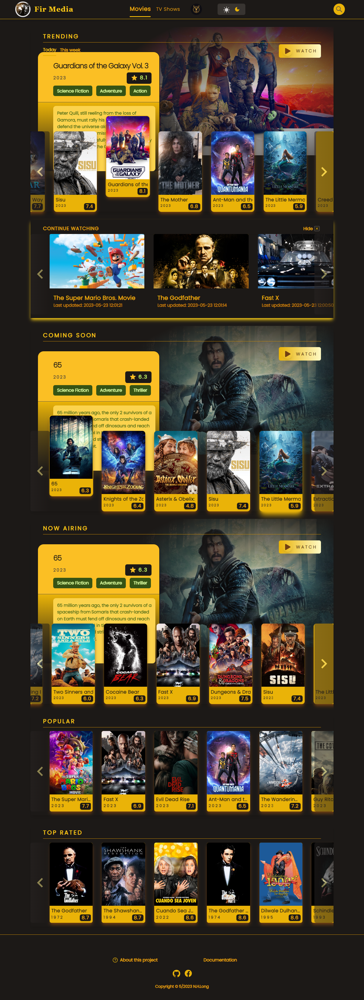
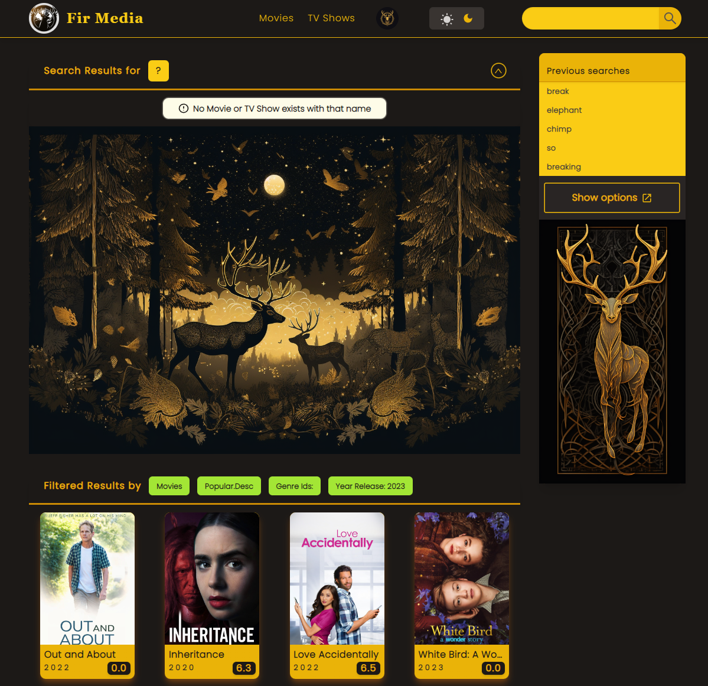
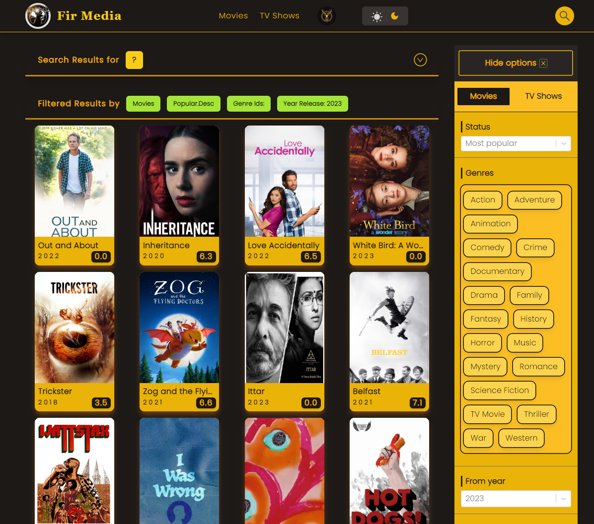
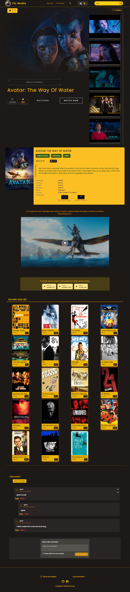
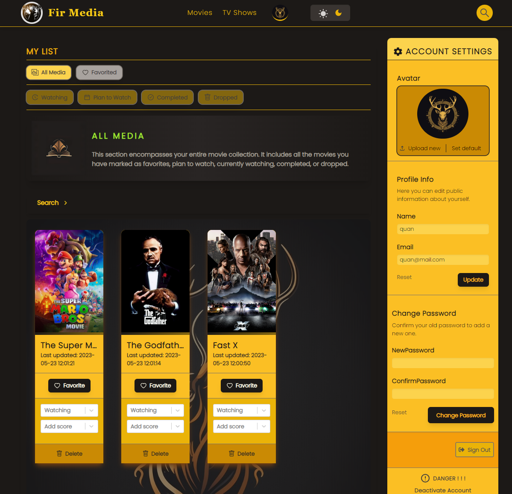
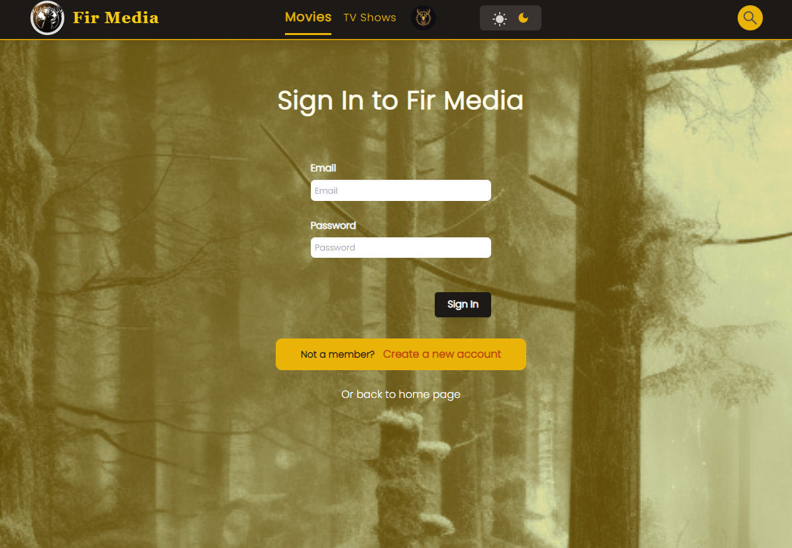

<!-- Improved compatibility of back to top link: See: https://github.com/nhlong27/dengueapp/pull/73 -->
<a id="readme-top"></a>

<!-- PROJECT SHIELDS -->
[![Contributors][contributors-shield]][contributors-url]
[![Forks][forks-shield]][forks-url]
[![Stargazers][stars-shield]][stars-url]
[![Issues][issues-shield]][issues-url]
[![MIT License][license-shield]][license-url]
[![LinkedIn][linkedin-shield]][linkedin-url]

<!-- PROJECT LOGO -->
<br />
<div align="center">
  <a href="https://github.com/nhlong27/..">
    
  </a>

  <h3 align="center">FIR MEDIA</h3>

  <p align="center">
    A nature-inspired movie website
    <br />
    Author: Nguyen Hoang Long 
    <br />
    <a href="">View Demo</a>
    ·
    <a href="https://github.com/nhlong27/../issues">Report Bug</a>
    ·
    <a href="https://github.com/nhlong27/../issues">Request Feature</a>
  </p>
</div>

## Live Demo
Official website: <a href="">dfdfdfdff</a>

<!-- TABLE OF CONTENTS -->
<details>
  <summary>Table of Contents</summary>
  <ol>
    <li>
      <a href="#about-the-project">About The Project</a>
      <ul>
        <li><a href="#built-with">Built With</a></li>
      </ul>
    </li>
    <li>
      <a href="#getting-started">Getting Started</a>
      <ul>
        <li><a href="#prerequisites">Prerequisites</a></li>
        <li><a href="#installation">Installation</a></li>
      </ul>
    </li>
    <li><a href="#usage">Usage</a></li>
    <li><a href="#roadmap">Roadmap</a></li>
    <li><a href="#contributing">Contributing</a></li>
    <li><a href="#license">License</a></li>
    <li><a href="#contact">Contact</a></li>
    <li><a href="#acknowledgments">Acknowledgments</a></li>
  </ol>
</details>


<!-- ABOUT THE PROJECT -->
## About The Project

Fir Media celebrates the beauty and wonder of the natural world through the lens of cinema. Browse and and let the power of films transport you to the world's most breathtaking landscapes.


#
## Screenshots
<a id='screenshot'></a>
<details>
  <summary>Toggle Show/Hide</summary>
  <h1>Home page</h1>
  
  <p align="right"><a href="#screenshot">back to section</a></p>

  <h1>Search by keyword</h1>
  
  <p align="right"><a href="#screenshot">back to section</a></p>

  <h1>Search by filters</h1>
  
  <p align="right"><a href="#screenshot">back to section</a></p>

  <h1>Media page</h1>
  
  <p align="right"><a href="#screenshot">back to section</a></p>

  <h1>Profile page</h1>
  
  <p align="right"><a href="#screenshot">back to section</a></p>

  <h1>Sign in/ Sign up</h1>
  
  <p align="right"><a href="#screenshot">back to section</a></p>
</details>


<!-- 
[![Product Name Screen Shot][homePage-screenshot]](...url)
[![Product Name Screen Shot][explorePage_search-screenshot]](...url)
[![Product Name Screen Shot][explorePage_filter-screenshot]](...url)
[![Product Name Screen Shot][mediaPage-screenshot]](...url)
[![Product Name Screen Shot][profilePage-screenshot]](...url) -->
#

## Duration
Around 2 months - March to May 2023 
## User stories  
<b>Note</b>: media = movie | TV shows
<ul>
  <li>User should be able to see recommended (Trending, Up coming, Airing now, Top rated, Most popular) media in <i>Home page</i>
  </li>
  <li>User should be able to search for media by: <i>keyword</i>, <i>filter options</i> 
  </li>
  <li>User should be able to see click and see further information about a media such as: <i>overview</i>, <i>trailers</i>, <i>genres</i>, <i>similar media</i>, etc.
  </li>
  <li>User should be able to watch media or trailers of a media</li>
  <li>User should be able to Sign in/ Sign up/ Sign out/ Deactivate account</li>
  <li>User should be able to edit profile information such as: <i>Username</i>, <i>email</i>, <i>avatar</i>, <i>password</i></li>
  <li>User should be able to add media to profile list and categorize them based on: <i>Favorite</i>, <i>Is Watching</i>, <i>Plan to Watch</i>, <i>Completed</i>, <i>Dropped</i>. The "Is Watching" category should be displayed in <i>Home page</i> </li>
  <li>User should be able to change their score and categorization of any media </li>
  <li>User should be able to see the comment section as well as add and delete their comments for a media </li>
</ul>

<h2>Challenges</h2>
<ul>
  <li>Use 100% Typescript with frontend and backend</li>
  <li>Pick a suitable API</li>
  <li>Pick state management library for client side (between Redux, Zustand, Jotai or React Context, + React Query)</li>
  <li>Pick a UI routing options</li>
  <li>Implement auth</li>
  <li>Pick a suitable database paradigm</li>
  <li>Create unit tests</li>
  <li>Deploy frontend and backend on seperate machines</li>
</ul>

<h2>Solutions</h2>

<h3>API Source</h3>
The Movie Database API

### Solution Stack

Here are all major frameworks/libraries used to bootstrap this project
* [![React][React-badge]][React-url]
* [![Typescript][Typescript-badge]][Typescript-url]
* [![TailwindCSS][TailwindCSS-badge]][TailwindCSS-url]
* [![Jotai][Jotai-badge]][Jotai-url]
* [![Zustand][Zustand-badge]][Zustand-url]
* [![Zod][Zod-badge]][Zod-url]
* [![Vite][Vite-badge]][Vite-url]
* [![NodeJS][NodeJS-badge]][NodeJS-url]
* [![ExpressJS][ExpressJS-badge]][ExpressJS-url]
* [![MongoDB][MongoDB-badge]][MongoDB-url]
<br/> 
<br/> 
<b>Note</b>: necessary libraries may have been left out
* React-Query with Axios
* Mongoose
* React Hook Form
* React Router v6
* React Auto-Animated
* React Toastify
* React Infinite Scroll Component
* React Lazy Load Image Component
* React Router Dom

### Images & Icons
* React Icons
* Midjourney 

<p align="right">(<a href="#readme-top">back to top</a>)</p>

<!-- GETTING STARTED -->
## Getting Started

Originally setup extended from 
* [vite-react-ts-eslint-prettier](https://github.com/igdev116/vite-react-ts-eslint-prettier)

### Installation

_Below is how you can install and set up your app._

1. Default hosts are *** and ***. Create your own accounts
2. Clone the repo
   ```sh
   git clone https://github.com/nhlong27/movieSite
   ```
3. Install NPM packages
   ```sh
   npm install
   ```
4. Replace with your local environment variables: 
   ```js
   const ***
   
   ```

<p align="right">(<a href="#readme-top">back to top</a>)</p>


<!-- CONTRIBUTING -->
## Contributing

Contributions are what make the open source community such an amazing place to learn, inspire, and create. Any contributions you make are **greatly appreciated**.

If you have a suggestion that would make this better, please fork the repo and create a pull request. You can also simply open an issue with the tag "enhancement".
Don't forget to give the project a star! Thanks again!

1. Fork the Project
2. Create your Feature Branch (`git checkout -b feature/AmazingFeature`)
3. Commit your Changes (`git commit -m 'Add some AmazingFeature'`)
4. Push to the Branch (`git push origin feature/AmazingFeature`)
5. Open a Pull Request

<p align="right">(<a href="#readme-top">back to top</a>)</p>


<!-- LICENSE -->
## License

<!-- Distributed under the MIT License. See `LICENSE.txt` for more information. -->
None yet
<p align="right">(<a href="#readme-top">back to top</a>)</p>

<!-- ACKNOWLEDGMENTS -->
## Acknowledgments

This space is for resources I found helpful and would like to give credit to.

* [Moonlight Films - fuocy](https://github.com/kettanaito/naming-cheatsheet)
* [GitHub Naming Cheetsheet](https://github.com/kettanaito/naming-cheatsheet)
* [Git Conventional Naming](https://www.conventionalcommits.org/en/v1.0.0/)
* [Tkdodo's Blog - Mastering React Query](https://tkdodo.eu/blog/practical-react-query)
* [Img Shields](https://shields.io)
* [React Icons](https://react-icons.github.io/react-icons/search)
* [Why choose Vite over Webpack?](https://www.reddit.com/r/vuejs/comments/r0fbfw/eli5_why_is_vite_so_much_faster_than_webpack/)
* [RefactoringUI](https://www.refactoringui.com/) 
* [React bulletproof](https://github.com/alan2207/bulletproof-react/blob/master/docs/project-structure.md)
* [Midjourney](https://www.midjourney.com/)

<p align="right">(<a href="#readme-top">back to top</a>)</p>


<!-- MARKDOWN LINKS & IMAGES -->

<!-- https://www.markdownguide.org/basic-syntax/#reference-style-links -->
[contributors-shield]: https://img.shields.io/github/contributors/nhlong27/movieSite.svg?style=for-the-badge
[contributors-url]: https://github.com/nhlong27/movieSite/graphs/contributors
[forks-shield]: https://img.shields.io/github/forks/nhlong27/movieSite.svg?style=for-the-badge
[forks-url]: https://github.com/nhlong27/movieSite/network/members
[stars-shield]: https://img.shields.io/github/stars/nhlong27/movieSite.svg?style=for-the-badge
[stars-url]: https://github.com/nhlong27/movieSite/stargazers
[issues-shield]: https://img.shields.io/github/issues/nhlong27/movieSite.svg?style=for-the-badge
[issues-url]: https://github.com/nhlong27/movieSite/issues
[license-shield]: https://img.shields.io/github/license/nhlong27/movieSite.svg?style=for-the-badge
[license-url]: https://github.com/nhlong27/movieSite/blob/master/LICENSE.txt
[linkedin-shield]: https://img.shields.io/badge/-LinkedIn-black.svg?style=for-the-badge&logo=linkedin&colorB=555
[linkedin-url]: https://www.linkedin.com/in/long-nguyen-95517b250/

<!-- Screenshots -->
[homePage-screenshot]: screenshots/homePage.png
[explorePage_search-screenshot]: screenshots/explorePage_search.png
[explorePage_filter-screenshot]: screenshots/explorePage_filter.png
[mediaPage-screenshot]: screenshots/mediaPage.png
[profilePage-screenshot]: screenshots/profilePage.png
[authPage-screenshot]: screenshots/authPage.png

<!-- Frameworks/libraries -->
[React-badge]: https://img.shields.io/badge/React-20232A?style=for-the-badge&logo=react&logoColor=61DAFB
[React-url]: https://reactjs.org/
[Vite-badge]: https://img.shields.io/badge/vite-%23646CFF.svg?style=for-the-badge&logo=vite&logoColor=white
[Vite-url]: https://vitejs.dev/
[TailwindCSS-badge]: https://img.shields.io/badge/tailwindcss-%2338B2AC.svg?style=for-the-badge&logo=tailwind-css&logoColor=white
[TailwindCSS-url]: https://tailwindcss.com/
[Jotai-badge]: https://img.shields.io/badge/-Jotai-white?style=for-the-badge
[Jotai-url]: https://jotai.org/
[NodeJS-badge]: https://img.shields.io/badge/node.js-6DA55F?style=for-the-badge&logo=node.js&logoColor=white
[NodeJS-url]: https://nodejs.org/en/
[MongoDB-badge]: https://img.shields.io/badge/MongoDB-4EA94B?style=for-the-badge&logo=mongodb&logoColor=white
[MongoDB-url]: https://www.mongodb.com/
[ExpressJS-badge]: 	https://img.shields.io/badge/Express.js-404D59?style=for-the-badge
[ExpressJS-url]: https://expressjs.com/
[Zustand-badge]: https://img.shields.io/badge/-zustand-orange
[Zustand-url]: https://github.com/pmndrs/zustand
[Typescript-badge]: https://img.shields.io/badge/TypeScript-007ACC?style=for-the-badge&logo=typescript&logoColor=white
[Typescript-url]: https://www.typescriptlang.org/
[Zod-badge]: https://img.shields.io/badge/-zod-blue
[Zod-url]: https://zod.dev/


<!-- ROADMAP -->
<!-- ## Development Pipeline

**DESIGN**

usbat: "user should be able to"
_item_: "movie" || "tv"
_recommended_: {
  movie: {
    trending,
    upcoming,
    now-playing
  },
  tv: {
    trending,
    on-the-air,
    airing-today
  }
}
_filters_: {
  movie: {
    sort_by: {
      popularity.asc,
      popularity.desc,
      release_date.desc,
      vote_average.desc,
      vote_average.asc,
      vote_count.desc,
      vote_count.asc,
    },
    year,
    with_genres
  },
  tv: {
    sort_by: {
      popularity.asc,
      popularity.desc,
      first_air_date.desc,
      vote_average.desc,
      vote_average.asc,
      vote_count.desc,
      vote_count.asc,
    },
    first_air_date_year,
    with_genres,
    with_status: {
      Planned,
      In Production,
      Ended,
      Cancelled,
      Pilot
    },
    with_type: {
      Documentary,
      News,
      Miniseries,
      Reality,
      Scripted,
      TalkShow',
      Video,
    },
  }
}
_overview_: {
  movie: [
    title, overview, genres, vote_average, vote_count, runtime, status, tagline, release_date, spoken_languages{name}, (poster_path, backdrop)
  ],
  tv: [
    tagline, name, overview, genres, vote_average, vote_count, episode_run_time, status, type, next_episode_to_air{episode_number, name, season_number, id, air_date}, last_episode_to_air{episode_number, name, , id, air_date}, first_air_date, spoken_languages{name}, networks[{name,logo_path}], number_of_seasons
  ]
}
_casts_: [
  get[cast{name, profile_path, character}, crew{job, name, profile_path}]
]
_reviews_: [
  results[{author_details{username,avatar_path,rating}, content, created_at}]
]
_similar_: [
  results[{backdrop_path, genre_ids, name, vote_average, vote_count, first_air_date, overview, popularity, id}]
]
_additionals_: {
  movie: [
    get[videos{key}]
  ],
  tv: [
    get[season{episodes{air_date, episode_number, name, id, still_path, vote_average}, season_number, name, poster_path}]
  ]
}
_item-list_: [
  _added-item_: {
    status/"Add to List": {
      watching,
      plan-to-watch,
      dropped,
      completed,
      none/"Add status"
    },
    score/"Select score",
    isFavorited/"Add to Favorites",
    <!-- isReviewed/Reviews,
    isDiscussed/Discussion 
    user,
    title,
    name,
    poster_path,
    season_number,
    id,
    createdAt,
    updatedAt
  }
]

###
Info:
    Item details: 
        imagery: poster_path, backdrop_path, trailers*
        overview: 
           movie: *title*, *tagline*, *overview*, status, *vote_average*, *release_date*, *runtime*, *budget*, *revenue*, original_language, *genres [{name}]*, *production_companies [{name}]*,
           *production_countries [{name}]*,
           ( vote_count, popularity)

           tv: name, tagline, overview, status, type, vote_average, first_air_date, episode_run_time [number], number_of_seasons, number_of_episodes,
           genres [{name}],
           original_language,
           created_by [{name, profile_path}],
            production_companies [{name}],
           production_countries [{name}], 
           networks [{name, logo_path}],

           last_episode_to_air {air_date, episode_number, name, overview, season_number, still_path} -> (season_number -> getSeason)

           next_episode_to_air {air_date, episode_number, name, overview, season_number, still_path},
           
           seasons [{season_number, episode_count, poster_path, name, overview, air_date, id}]
           (vote_count, popularity)

        user-related: user score, status, isFavorited
    Lists: similar: (you may also like)
Actions:
    Watch: - Choose different servers
    Add to Favorite
    Add Score
    Add Status
###

usbat see _recommended_[_item_] 

usbat search for _item_
  usbat search by keyword
  usbat search by _filters_[_item_][...]

usbat see _item_ information 
    watch, overview, reviews, cast, comments, slides
    usbat see _overview_[_item_]
    usbat see _casts_
    usbat see _reviews_:
    usbat see _similar_:
    usbat see _additionals_[_item_]

usbat watch _item_

usbat read and write customized information
  usbat sign up/ sign in/ sign out/ delete account
  usbat read and write personal information
  usbat read and write _added-item_ in _item-list_
  usbat read and write their reviews for _item_ 
  usbat read and write their comments for _item_ 

  Status [default: Watching] - Score - Reviews - Favorite - Comments
  'Plan to watch', ['Watching','Dropped','Completed'] && score
  (score || review || favorite) && (status ? 'watching' : status) -->

<!-- 

## Architecture

**CLIENT STATE**
  **Server API Layer**
  ### API/Request-Response Handling
    debounce
    Api_key -> proxy server: nginx route api requests
    Axios + React Query
      Infinity query
        Keep previous data
      % https://github.com/alan2207/react-query-auth
    Zustand - user, show form optimistic update + rollback/cancel mutations

  **UI/View Layer**
  ### Routing
    Code Splitting
      router + conditionals
      % https://sambitsahoo.com/blog/vite-code-splitting-that-works.html
    Transition
      framer-motion
    Loaders
    errorElement
  ### Error Handling
    Toast, reset form
    Receive server error handling -> React Query handles try-catch, error bubbling to route if no errorBoundary
    404 page - errorElement on <Route>
  ### Suspense Handling
    Skeleton
      react-loading-skeleton
    Lazy loading image
      browser lazyload
      blurhash

Construct step
  Responsive
  Home
    Movie Component
    Swiper
  Discover
    Filter section

  Profile

Functionality Step
  button disabled
Paint Step
  react auto animate - parent & children
  progress bar
  toggling dark/light theme

**SERVER STATE**
  **Client API Layer**
  ### API/Request-Response Handling
    Express
      res.append
      Routing
      % https://stackoverflow.com/questions/7042340/error-cant-set-headers-after-they-are-sent-to-the-client
    Error handling
      "When an error is thrown, the JavaScript runtime will immediately stop executing the current function and start unwinding the call stack to find a catch block that can handle the error. If no catch block is found, the error will be passed up to the global error handler, which will display an error message in the console or in the UI."
      "Without return, the code after res.send() would still be executed, even though it's unlikely to have any effect on the response to the client. For example, if you have logging statements or other code that modifies variables after the call to res.send(), it would still be executed even though it doesn't affect the response to the client.

      "Using return after res.send() is a good practice because it ensures that any subsequent code is not executed, which can help prevent errors and improve the performance of your code. However, if you're confident that there's no code after res.send() that would have unintended consequences, you can omit the return statement."
  **Domain**
  ### Middlewares (client has middleware too)

  **Persistence**
  ### Data types 
    MultiMedia
      % Using multer: https://www.youtube.com/watch?v=srPXMt1Q0nY
      % https://www.mongodb.com/community/forums/t/process-of-storing-images-in-mongodb/15093/5
  ### ORM
    Mongoose

**TEST**
**SECURITY**
  **Auth**
  # Tokens + Cookie
    Httponly cookie + browser CORS, xsrf support (axios withCredentials + corsOptions credentials: true, allow origin: localhost...)  
    % https://www.reddit.com/r/webdev/comments/rck2mv/where_is_best_place_to_store_the_bearer_token_you/
    % https://stackoverflow.com/questions/43002444/make-axios-send-cookies-in-its-requests-automatically
    % https://stackoverflow.com/questions/43772830/access-control-allow-credentials-header-in-the-response-is-which-must-be-t -->

<!-- **OTHERS**
 .gitignore - remove cache
% https://stackoverflow.com/questions/38983153/git-ignore-env-files-not-working
  setting up
% https://blog.tericcabrel.com/set-up-a-nodejs-project-with-typescript-eslint-and-prettier/
See the [open issues](https://github.com/nhlong27/movieSite/issues) for a full list of proposed features (and known issues). -->